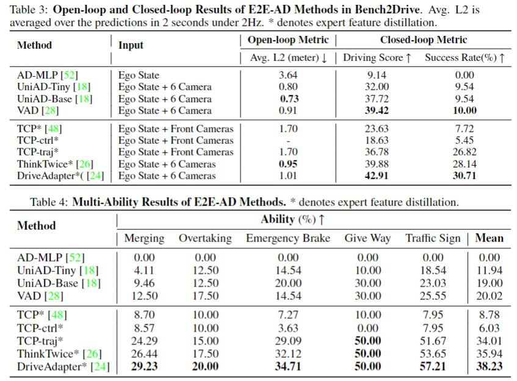

<h2 align="center">
  
</h2>

<h2 align="center">
  <a href="https://thinklab-sjtu.github.io/Bench2Drive/">Website</a> |
  <a href="https://huggingface.co/datasets/rethinklab/Bench2Drive">Huggingface</a> |
  <a href="https://arxiv.org/abs/2406.03877">arXiv</a> |
  <a href="https://github.com/Thinklab-SJTU/Bench2DriveZoo">Model</a> |
  <a href="https://discord.gg/uZuU3JXVNV">Discord</a>
</h2>


<h2 align="center">
What can Bench2Drive provide ? <b>Please click to view the video.</b>
<br>
<b>&#x2193;&#x2193;&#x2193;</b>
</h2>

[](https://www.youtube.com/watch?v=-osdzJJs2g0 "Bench2Drive")

#####
## Table of Contents: <a name="high"></a>
1. [News](#News)
2. [Dataset](#Dataset)
3. [Benchmark](#Benchmark)
4. [License](#license)
5. [Citation](#citation)

## News <a name="news"></a>
  - [2024/08/19] **[Major Updates]** To better assess driving performance, we add two additional metrics: Driving Efficiency and Driving Smoothness. Consequently, we remove the penalty for minimum speed in calculating the Drive Score and extend the TickRunTime from 2000 to 4000 to allow for a more lenient driving evaluation. We are currently reassessing all baselines. Please stay tuned.
  - [2024/08/10] We update the team_code agent of UniAD and VAD to fix the camera projection bug mentioned in 2024/07/29. Their corresponding scores will be uploaded soon with new metrics introduced.
  - [2024/07/29] As kindly suggested in an [issue](https://github.com/Thinklab-SJTU/Bench2Drive/issues/36), there is a bug in the team code agent of UniAD and VAD during evaluation, i.e, **the BACK CAMERA's extrinsic is wrong**. The training process is correct. To be consistent with the reported results, we do not modify the code right now. Users' are strongly encouraged to use the correct extrinsics.
  - [2024/07/22] We add more reminders in the evaluation code to avoid the miss of logs. According to [Haochen](https://github.com/georgeliu233)'s kind suggestion, we add automatic cleaning code in the evaluation toolkit. Users' may set in their bash script to restart the evaluation infinitely until finishing the evaluation since CARLA is easy to crash.
  - [2024/07/10] We further clean and add more clips in the Full set (13638 clips). Since HuggingFace only allows up to 10000 files per repo, we use two repos to store the Full set. As suggested in this issue [issue](https://github.com/Thinklab-SJTU/Bench2Drive/issues/17), we add a filelist and sha256 of clips for each set.
  - [2024/06/19] Due to a typo in the upload script for HuggingFace, all clips of scenario VehicleTurningRoutePedestrian are empty in the HuggingFace version. We have fixed that. Please check your data to make sure they are not empty. 
  - [2024/06/05] Bench2Drive realases the Full dataset (10000 clips), evaluation tools, baseline code, and benchmark results.
  - [2024/04/27] Bench2Drive releases the Mini (10 clips) and Base (1000 clips) split of the official training data.

## Dataset <a name="dataset"></a>
  - The datasets has 3 subsets, namely Mini (10 clips), Base (1000 clips) and Full (10000 clips), to accommodate different levels of computational resource.
  - [Detailed explanation](docs/anno.md) of dataset structure, annotation information, and visualization of data.

| Subset  | Hugging Face | Baidu Cloud | Approx. Size | File List|
| :---: |  :---: | :---: | :---: | :---: |
| Mini |   [Download script](https://github.com/Thinklab-SJTU/Bench2Drive/blob/main/tools/download_mini.sh) |  - |  4G | [Mini Json File](./docs/bench2drive_mini_10.json) |
| Base |  [Hugging Face Link](https://huggingface.co/datasets/rethinklab/Bench2Drive) |  [Baidu Cloud Link](https://pan.baidu.com/s/1ZIL-MPhLbgdBYmHkHncn8Q?pwd=1234) |  400G |  [Base Json File](./docs/bench2drive_base_1000.json)|
| Full |  [Full HF Link - 9888 files](https://huggingface.co/datasets/rethinklab/Bench2Drive-Full)/[Sup HF Link - 3814 file](https://huggingface.co/datasets/rethinklab/Bench2Drive-Full-Sup)   | - | 4T | [Full/Sup Json File](./docs/bench2drive_full+sup_13638.json)|

Note that the Mini Set is 10 representative scenes. You may download them by manually select file names from the Base set.

Use the command line: *huggingface-cli download --repo-type dataset --resume-download rethinklab/Bench2Drive --local-dir Bench2Drive-Base* to download from hugginface. User may consider [mirror site](https://hf-mirror.com/) if Huggingface is blocked. Use [BaiduPCS-Go](https://github.com/qjfoidnh/BaiduPCS-Go) to download from Baidu Cloud. Both command lines are resumable.

## Baseline Code
  - [Uniad/VAD](https://github.com/Thinklab-SJTU/Bench2DriveZoo/tree/uniad/vad) in Bench2Drive
  - [TCP/ADMLP](https://github.com/Thinklab-SJTU/Bench2DriveZoo/tree/tcp/admlp) in Bench2Drive
## Setup
  - Download and setup CARLA 0.9.15
    ```bash
        mkdir carla
        cd carla
        wget https://carla-releases.s3.us-east-005.backblazeb2.com/Linux/CARLA_0.9.15.tar.gz
        tar -xvf CARLA_0.9.15.tar.gz
        cd Import && wget https://carla-releases.s3.us-east-005.backblazeb2.com/Linux/AdditionalMaps_0.9.15.tar.gz
        cd .. && bash ImportAssets.sh
        export CARLA_ROOT=YOUR_CARLA_PATH
        echo "$CARLA_ROOT/PythonAPI/carla/dist/carla-0.9.15-py3.7-linux-x86_64.egg" >> YOUR_CONDA_PATH/envs/YOUR_CONDA_ENV_NAME/lib/python3.7/site-packages/carla.pth # python 3.8 also works well, please set YOUR_CONDA_PATH and YOUR_CONDA_ENV_NAME
    ```

## Eval Tools
  - Add your agent to leaderboard/team_code/your_agent.py & Link your model folder under the Bench2Drive directory.
    ```bash
        Bench2Drive\ 
          assets\
          docs\
          leaderboard\
            team_code\
              --> Please add your agent HEAR
          scenario_runner\
          tools\
          --> Please link your model folder HEAR
    ```
  - Debug Mode
    ```bash
        # Verify the correctness of the team agent， need to set GPU_RANK, TEAM_AGENT, TEAM_CONFIG
        bash leaderboard/scripts/run_evaluation_debug.sh
    ```
  - Multi-Process Multi-GPU Parallel Eval. If your team_agent saves any image for debugging, it might take lots of disk space.
    ```bash
        # Please set TASK_NUM, GPU_RANK_LIST, TASK_LIST, TEAM_AGENT, TEAM_CONFIG, recommend GPU: Task(1:2).
        # It is normal that certain model can not finsih certain routes, no matter how many times we restart the evaluation. It should be treated as failing as it usually happens in the routes where agents behave badly.
        bash leaderboard/scripts/run_evaluation_multi_uniad.sh
    ```
  - Visualization - make a video for debugging with canbus info printed on the sequential images.
    ```bash
        python tools/generate_video.py -f your_rgb_folder/
    ```
  - Metric: **Make sure there are exactly 220 routes in your jason. Failed/Crashed status is also acceptable. Otherwise, the metric is inaccurate.**
    ```bash
        # Merge eval json and get driving score and success rate
        # This script will assume the total number of routes with results is 220. If there is not enough, the missed ones will be treated as 0 score.
        python tools/merge_reoute_json.py -f your_json_folder/

        # Get multi-ability results
        python tools/ability_benchmark.py -r merge.json

        # Get driving efficiency and driving smoothness results
        python tools/efficiency_smoothness_benchmark.py -f merge.json -m your_metric_folder/
    ```

## Benchmark <a name="benchmark"></a>



## License <a name="license"></a>

All assets and code are under the [Apache 2.0 license](./LICENSE) unless specified otherwise.

## Citation <a name="citation"></a>

Please consider citing our papers if the project helps your research with the following BibTex:

```bibtex
@article{jia2024bench,
  title={Bench2Drive: Towards Multi-Ability Benchmarking of Closed-Loop End-To-End Autonomous Driving},
  author={Xiaosong Jia and Zhenjie Yang and Qifeng Li and Zhiyuan Zhang and Junchi Yan},
  journal={arXiv preprint arXiv:2406.03877},
  year={2024}
}

@inproceedings{li2024think,
  title={Think2Drive: Efficient Reinforcement Learning by Thinking in Latent World Model for Quasi-Realistic Autonomous Driving (in CARLA-v2)},
  author={Qifeng Li and Xiaosong Jia and Shaobo Wang and Junchi Yan},
  booktitle={ECCV},
  year={2024}
}
```

