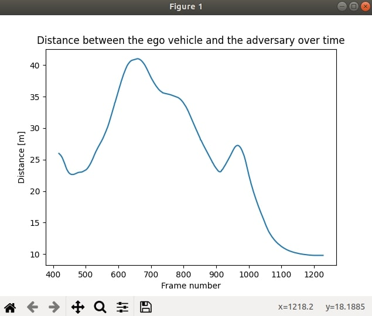

# Metrics module


The metrics module relies on the [CARLA recorder](https://carla.readthedocs.io/en/latest/adv_recorder/) to facilitate the easy calculus and monitoring of any kind of parameter. After the scenario is finished, the recorder stores the simulation information. Users can then define their own metrics, and check the corresponding results with no need to play the simulation again and again. 

This section covers an explanation of the different elements that form the module, a step by step tutorial of how to create a new metric, and a reference of the functions that query the recording and define the metrics.  

* [__Structure of the module__](#structure-of-the-module)  
* [__How to use the metrics module__](#how-to-use-the-metrics-module)  
	* [1. Record a scenario](#1.-record-a-scenario)  
	* [2. Define the metrics](#2.-run-the-metrics-manager)  
	* [3. Run the metrics manager](#3.-run-the-metrics-manager)  
* [__Recording queries reference__](#recording-queries-reference)  
	* [Generic actor data](#generic-actor-data)  
	* [Generic simulation data](#generic-simulation-data)  
	* [Actor accelerations](#actor-accelerations)  
	* [Actor angular velocities](#actor-angular-velocities)  
	* [Actor controls](#actor-controls)  
	* [Actor transforms](#actor-transforms)  
	* [Actor velocities](#actor-velocities)  
	* [Scene lights](#scene-lights)  
	* [Traffic lights](#traffic-lights)  
	* [Vehicle lights](#vehicle-lights)  

---
## Structure of the module

Similarly to the main ScenarioRunner module, the Metrics module is run using a main script, `metrics_manager.py`, and the rest of the information is contained inside a folder structure. Here is a brief introduction to the main script.  

*   __`metrics_manager.py`__ — The main script of the module. Run this to show the results of the set of metrics. The script has the usual `host` and `port` arguments, and some more to set the metrics and recording to be used.  
	*   `host` *(string)* – IP address where a CARLA simulation is running. Default is `(127.0.0.1)`.  
	*   `port` *(int)* – TCP port where the CARLA simulation is running. Default are `2000` and `2001`.  
	*   `metrics` — Path to the metrics to be used.  
	*   `log` — Path to the `.log` file containing the recording (relative to the environment variable `SCENARIO_RUNNER_ROOT`).  
	*   `criteria` *(optional)* — Path to a JSON file with the criteria of the scenario.  

The rest of the elements that shape the module can be found in the `srunner/metrics` folder. These folder has been divided in three subfolders.

* __`srunner/metrics/data`__ — Stores information about the scenarios. By default, it has six files, which are part of the examples metric.  

* __`srunner/metrics/examples`__ — Contains some example metrics, and the metric containing the base class `BaseMetric` to create new metrics.  
	*   `basic_metric.py` – Contains the base class `BaseMetric`. All the metrics are inherited from it.  
	*   `criteria_filter.py` – Returns a JSON with the most important attributes of the criteria. 
	*   `distance_between_vehicles.py` – Returns the distance betwen two vehicles. Useful to show how to query the recording.  
	*   `distance_to_lane_center.py` – Calculates the distance between the vehicle location and the center of the lane. Useful to show how to access the map API information..  

* __`srunner/metrics/tools`__ — Contains two key scripts that allow to query the recording.  
	*   `metrics_parser.py` – Transforms the string provided by the recording to a dictionary.  
	*   `metrics_log.py` – Provides with several functions to query the dictionary created with `metrics_parser.py`. These functions are the easiest way to access information of a scenario. They listed in a [reference](#recording-queries-reference) in the last segment of this page.  

---
## How to use the metrics module

### 1. Record a scenario

The metrics module needs for a recording of a simulation in order to work. Otherwise, it has no data to make the calculations of the metrics.  

Use the `record` argument. Add the path where the information should be saved should be saved. The path must be relative to the environment variable `SCENARIO_RUNNER_ROOT`.  

```sh
python scenario_runner.py --scenario <scenario_name> --record <path/to/save/the/recorder/file>
```

By recording the scenario two files will be created in the desired path. These files will later be used as the `log` and `criteria` arguments in the `metrics_manager.py`.  
__1. A CARLA recording__ *(`.log`)* — Contains simulation data per frame. To know more about this, read the [recorder docs](https://carla.readthedocs.io/en/latest/adv_recorder/).  
__2. A criteria file__ *(.json)* — The criteria of the scenario parsed as a dictionary, and stored in a JSON file. The keys of the dictionary are the names of the criteria. The values are the attributes of each criteria.

!!! Note
    Only the JSON serializable attributes will be parsed, the rest will be ignored.

 By default, both files are named after the scenario that is run. If the scenario is named `example.py`, the files will be `example.log` and `example.json`.  


### 2. Define the metrics

It is time to create the desired metrics that will be used for the scenario. The possibilities are endless, but for the sake of this tutorial, the metric described in `srunner/metrics/examples/distance_between_vehicles.py` will be used as an example. Let's dig a little bit into the code itself.  

    class DistanceBetweenVehicles(BasicMetric):
    """
    Metric class DistanceBetweenVehicles
    """

    def _create_metric(self, town_map, log, criteria):
        """
        Implementation of the metric. This is an example to show how to use the recorder,
        accessed via the log.
        """

        # Get the ID of the two vehicles
        ego_id = log.get_ego_vehicle_id()
        adv_id = log.get_actor_ids_with_role_name("scenario")[0]  # Could have also used its type_id

        dist_list = []
        frames_list = []

        # Get the frames both actors were alive
        start_ego, end_ego = log.get_actor_alive_frames(ego_id)
        start_adv, end_adv = log.get_actor_alive_frames(adv_id)
        start = max(start_ego, start_adv)
        end = min(end_ego, end_adv)

        # Get the distance between the two
        for i in range(start, end):

            # Get the transforms
            ego_location = log.get_actor_transform(ego_id, i).location
            adv_location = log.get_actor_transform(adv_id, i).location

            # Filter some points for a better graph
            if adv_location.z < -10:
                continue

            dist_v = ego_location - adv_location
            dist = math.sqrt(dist_v.x * dist_v.x + dist_v.y * dist_v.y + dist_v.z * dist_v.z)

            dist_list.append(dist)
            frames_list.append(i)

        # Use matplotlib to show the results
        plt.plot(frames_list, dist_list)
        plt.ylabel('Distance [m]')
        plt.xlabel('Frame number')
        plt.title('Distance between the ego vehicle and the adversary over time')
        plt.show()

__2.1. Name the metric__. First of all, as it was previously mentioned, all metrics are childs of the `BasicMetric` class.

```py
    class DistanceBetweenVehicles(BasicMetric):
```

__2.2. Name the main method__. A metric only requires one method in order to run, `_create_metric()`, which has three arguments.  

*   __`town_map`__ — Instance of the [carla.Map()](https://carla.readthedocs.io/en/latest/python_api/#carlamap) where the scenario took place in.  
*   __`log`__ — Instance to the `MetricsLog` class, with all the functions needed to access the recorder dictionary.  
*   __`criteria`__ — A JSOn with the criteria dictionary. The file provided when recording a scenario that is later provided to the `metrics_manager.py`.  

```py
    def _create_metric(self, town_map, log, criteria):
```

__2.3. Implement the metric__. The code will vary depending on the metric itself.  

The example metric `DistanceBetweenVehicles` calculates the distance between the ego vehicle, and the car it follows (adversary). To do so, it needs the `id` of the two vehicles. These can be retrieved from the log using the `get_ego_vehicle_id()` and `get_actor_ids_with_role_name("scenario")[0]` functions. 

```py
    # Get the ID of the two vehicles
    ego_id = log.get_ego_vehicle_id()
    adv_id = log.get_actor_ids_with_role_name("scenario")[0]  # Could have also used its type_id
```

The `id` are used to retrieve the frames where the vehicles were alive using `get_actor_alive_frames(actor_id)`. 
```py
    # Get the frames both actors were alive
    start_ego, end_ego = log.get_actor_alive_frames(ego_id)
    start_adv, end_adv = log.get_actor_alive_frames(adv_id)
    start = max(start_ego, start_adv)
    end = min(end_ego, end_adv)
```

Now everything is ready to loop through those frames, get their transforms, and calculate the distance. To get the transform, `get_actor_transform(actor_id, frame)` is used. 

```py
    dist_list = []
    frames_list = []

...

    # Get the distance between the two
    for i in range(start, end):

        # Get the transforms
        ego_location = log.get_actor_transform(ego_id, i).location
        adv_location = log.get_actor_transform(adv_id, i).location

        # Filter some points for a better graph
        if adv_location.z < -10:
            continue

        dist_v = ego_location - adv_location
        dist = math.sqrt(dist_v.x * dist_v.x + dist_v.y * dist_v.y + dist_v.z * dist_v.z)

        dist_list.append(dist)
```
!!! Note
    The vertical condition of the adversary is to only take into account the adversary when it is driving normally.

Lastly, use [matplotlib](https://matplotlib.org/) to define which should be the output of the metric when running `metrics_manager.py`.  

```py
        # Use matplotlib to show the results
        plt.plot(frames_list, dist_list)
        plt.ylabel('Distance [m]')
        plt.xlabel('Frame number')
        plt.title('Distance between the ego vehicle and the adversary over time')
        plt.show()
```

### 3. Run the metrics manager

Finally it is time to used the information retrieve from the scenario, and the metrics that have been defined to return some metrics information. Let's run the module using the example metric that has been used so far, and an example log named after it.  

```sh
python metrics_manager.py --metric srunner/metrics/examples/distance_between_vehicles.py --log srunner/metrics/data/DistanceBetweenVehicles.log
```

!!! Warning
    A simulation must be running. Otherwise, the module will not be able to acces the map API.


This will create a new window with the results plotted. The script will not finish until the ouput window is closed.



---
## Recording queries reference

When defining a metric, all the information about the scenario is accessed via the `MetricsLog` class (the `log` argument at the `_create_metric()` function). This class is located at `srunner/metrics/tools/metrics_log.py`, and this reference is a following of the functions contained in it.  

### Generic actor data

- <a name="get_ego_vehicle_id"></a>__<font color="#7fb800">get_ego_vehicle_id</font>__(<font color="#00a6ed">__self__</font>)  
Returns the `id` of the ego vehicle.
    - __Return —__ int

- <a name="get_actor_ids_with_role_name"></a>__<font color="#7fb800">get_actor_ids_with_role_name</font>__(<font color="#00a6ed">__self__</font>, <font color="#00a6ed">__role_name__</font>)  
Returns a list of actor `id` that match the given `role_name`.
    - __Return —__ list
    - __Parameters__
        - `role_name` (_str_) — `role_name` of the actor.

- <a name="get_actor_ids_with_type_id"></a>__<font color="#7fb800">get_actor_ids_with_type_id</font>__(<font color="#00a6ed">__self__</font>, <font color="#00a6ed">__type_id__</font>)  
Returns a list of actor `id` that match the given `type_id`, according to fnmatch standard.
    - __Return —__ list
    - __Parameters__
        - `type_id` (_str_) — `type_id` of the actor.

- <a name="get_actor_attributes"></a>__<font color="#7fb800">get_actor_attributes</font>__(<font color="#00a6ed">__self__</font>, <font color="#00a6ed">__actor_id__</font>)  
Returns a dictionary with all the attributes of an actor.
    - __Return —__ dict
    - __Parameters__
        - `actor_id` (_int_) — `id` of the actor.

- <a name="get_actor_bounding_box"></a>__<font color="#7fb800">get_actor_bounding_box</font>__(<font color="#00a6ed">__self__</font>, <font color="#00a6ed">__actor_id__</font>)  
Returns the bounding box of the specified actor.
    - __Return —__ [carla.BoundingBox](https://carla.readthedocs.io/en/latest/python_api/#carlaboundingbox)
    - __Parameters__
        - `actor_id` (_int_) — `id` of the actor.

- <a name="get_traffic_light_trigger_volume"></a>__<font color="#7fb800">get_traffic_light_trigger_volume</font>__(<font color="#00a6ed">__self__</font>, <font color="#00a6ed">__traffic_light_id__</font>)  
Returns the trigger volume of the specified traffic light.
    - __Return —__ [carla.BoundingBox](https://carla.readthedocs.io/en/latest/python_api/#carlaboundingbox)
    - __Parameters__
        - `traffic_light_id` (_int_) — `id` of the traffic light.

- <a name="get_actor_alive_frames"></a>__<font color="#7fb800">get_actor_alive_frames</font>__(<font color="#00a6ed">__self__</font>, <font color="#00a6ed">__actor_id__</font>)  
Returns a tuple with the first and last frame an actor was alive. Note that frames start at 1, not 0.
    - __Return —__ tuple
    - __Parameters__
        - `actor_id` (_int_) — `id` of the actor.


### Generic simulation data

- <a name="get_collisions"></a>__<font color="#7fb800">get_collisions</font>__(<font color="#00a6ed">__self__</font>,<font color="#00a6ed">__actor_id__</font>)  
Returns a list of dictionaries with two keys. `frame` is the frame number of the collision, and `other_id`, a list of the ids the actor collided with at that frame.
    - __Return —__ list
    - __Parameters__
        - `actor_id` (_int_) — `id` of the actor.

- <a name="get_total_frame_count"></a>__<font color="#7fb800">get_total_frame_count</font>__(<font color="#00a6ed">__self__</font>)  
Returns an int with the total amount of frames the simulation lasted.
    - __Return —__ int

- <a name="get_elapsed_time"></a>__<font color="#7fb800">get_elapsed_time</font>__(<font color="#00a6ed">__self__</font>, <font color="#00a6ed">__frame__</font>)  
Returns a float with the elapsed time of a specific frame.
    - __Return —__ float
    - __Parameters__
        - `frame` (_int_) — Frame number.

- <a name="get_delta_time"></a>__<font color="#7fb800">get_delta_time</font>__(<font color="#00a6ed">__self__</font>, <font color="#00a6ed">__frame__</font>)  
Returns an float with the delta time of a specific frame.
    - __Return —__ float
    - __Parameters__
        - `frame` (_int_) — Frame number.

- <a name="get_platform_time"></a>__<font color="#7fb800">get_platform_time</font>__(<font color="#00a6ed">__self__</font>, <font color="#00a6ed">__frame__</font>)  
Returns a float with the platform time of a specific frame.
    - __Return —__ float
    - __Parameters__
        - `frame` (_int_) — Frame number.

### Actor accelerations

- <a name="get_actor_acceleration"></a>__<font color="#7fb800">get_actor_acceleration</font>__(<font color="#00a6ed">__self__</font>, <font color="#00a6ed">__actor_id__</font>, <font color="#00a6ed">__frame__</font>)  
Returns the acceleration of the actor at a given frame. Returns <b>None</b> if the actor `id` doesn't exist, the actor has no acceleration, or the actor wasn't alive at that frame.
    - __Return —__ [carla.Vector3D](https://carla.readthedocs.io/en/latest/python_api/#carlavector3d)
    - __Parameters__
        - `actor_id` (_int_) — `id` of the actor.
        - `frame` (_int_) — Frame number.

- <a name="get_all_actor_accelerations"></a>__<font color="#7fb800">get_all_actor_accelerations</font>__(<font color="#00a6ed">__self__</font>, <font color="#00a6ed">__actor_id__</font>, <font color="#00a6ed">__first_frame__=None</font>, <font color="#00a6ed">__last_frame__=None</font>)  
Returns a list with all the accelerations of the actor at the frame interval. By default, the frame interval comprises all the recording.
    - __Return —__ list(carla.Vector3D)
    - __Parameters__
        - `actor_id` (_int_) — `id` of the actor.
        - `first_frame` (_int_) — Initial frame of the interval. By default, the start of the simulation.
        - `last_frame` (_int_) — Last frame of the interval. By default, the end of the simulation.

- <a name="get_actor_accelerations_at_frame"></a>__<font color="#7fb800">get_actor_accelerations_at_frame</font>__(<font color="#00a6ed">__self__</font>, <font color="#00a6ed">__frame__</font>, <font color="#00a6ed">__actor_list__=None</font>)  
Returns a dict where the keys are the frame number, and the values are the carla.Vector3D of the actor at the given frame. By default, all actors are considered but if *actor_list* is passed, only actors in the list will be checked.
    - __Return —__ list(carla.Vector3D)
    - __Parameters__
        - `frame` (_int_) — Frame number.
        - `actor_list` (_int_) — List of actor `id`.

### Actor angular velocities

- <a name="get_actor_angular_velocity"></a>__<font color="#7fb800">get_actor_angular_velocity</font>__(<font color="#00a6ed">__self__</font>, <font color="#00a6ed">__actor_id__</font>, <font color="#00a6ed">__frame__</font>)  
Returns the angular velocity of the actor at a given frame. Returns <b>None</b> if the actor id doesn't exist, the actor has no angular velocity, or the actor wasn't alive at that frame.
    - __Return —__ carla.Vector3D
    - __Parameters__
        - `actor_id` (_int_) — `id` of the actor.
        - `frame` (_int_) — Frame number.

- <a name="get_all_actor_angular_velocities"></a>__<font color="#7fb800">get_all_actor_angular_velocities</font>__(<font color="#00a6ed">__self__</font>, <font color="#00a6ed">__actor_id__</font>, <font color="#00a6ed">__first_frame__=None</font>, <font color="#00a6ed">__last_frame__=None</font>)  
Returns a list with all the angular velocities of the actor at the frame interval. By default, the frame interval comprises all the recording.
    - __Return —__ list(carla.Vector3D)
    - __Parameters__
        - `actor_id` (_int_) — `id` of the actor.
        - `first_frame` (_int_) — Initial frame of the interval. By default, the start of the simulation.
        - `last_frame` (_int_) — Last frame of the interval. By default, the end of the simulation.

- <a name="get_actor_angular_velocities_at_frame"></a>__<font color="#7fb800">get_actor_angular_velocities_at_frame</font>__(<font color="#00a6ed">__self__</font>, <font color="#00a6ed">__frame__</font>, <font color="#00a6ed">__actor_list__=None</font>)  
Returns a dictionary where the keys are the frame number, and the values are the [carla.Vector3D](https://carla.readthedocs.io/en/latest/python_api/#carlavector3d) of the actor at the given frame. By default, all actors are considered but if `actor_list` is passed, only actors in the list will be checked.
    - __Return —__ list([carla.Vector3D](https://carla.readthedocs.io/en/latest/python_api/#carlavector3d))
    - __Parameters__
        - `frame` (_int_) — frame number.
        - `actor_list` (_int_) — List of actor ids.

### Actor controls

- <a name="get_vehicle_control"></a>__<font color="#7fb800">get_vehicle_control</font>__(<font color="#00a6ed">__self__</font>, <font color="#00a6ed">__vehicle_id__</font>, <font color="#00a6ed">__frame__</font>)  
Returns the control of a vehicle at a given frame. The `manual_gear_shift` attribute will always be False.
    - __Return —__ [carla.VehicleCotnrol](https://carla.readthedocs.io/en/latest/python_api/#carlavehiclecontrol)
    - __Parameters__
        - `vehicle_id` (_int_) — `id` of the vehicle.
        - `frame` (_int_) — Frame number.

- <a name="get_vehicle_physics_control"></a>__<font color="#7fb800">get_vehicle_physics_control</font>__(<font color="#00a6ed">__self__</font>, <font color="#00a6ed">__vehicle_id__</font>, <font color="#00a6ed">__frame__</font>)  
Returns the physics control of a vehicle at a given frame.
    - __Return —__ [carla.VehiclePhysicsControl](https://carla.readthedocs.io/en/latest/python_api/#carlavehiclephysicscontrol)
    - __Parameters__
        - `vehicle_id` (_int_) — `id` of the vehicle.
        - `frame` (_int_) — Frame number.

- <a name="get_walker_speed"></a>__<font color="#7fb800">get_walker_speed</font>__(<font color="#00a6ed">__self__</font>, <font color="#00a6ed">__walker_id__</font>, <font color="#00a6ed">__frame__</font>)  
Returns the speed of a walker at a given frame.
    - __Return —__ [carla.Vector3D](https://carla.readthedocs.io/en/latest/python_api/#carlavector3d)
    - __Parameters__
        - `walker_id` (_int_) — `id` of the walker.
        - `frame` (_int_) — Frame number.


### Actor transforms

- <a name="get_actor_transform"></a>__<font color="#7fb800">get_actor_transform</font>__(<font color="#00a6ed">__self__</font>, <font color="#00a6ed">__actor_id__</font>, <font color="#00a6ed">__frame__</font>)  
Returns the transform of the actor at a given frame. Returns <b>None</b> if the actor id doesn't exist, the actor has no transform, or the actor wasn't alive at that frame.
    - __Return —__ [carla.Transform](https://carla.readthedocs.io/en/latest/python_api/#carlatransform)
    - __Parameters__
        - `actor_id` (_int_) — `id` of the actor.
        - `frame` (_int_) — Frame number.

- <a name="get_all_actor_transforms"></a>__<font color="#7fb800">get_all_actor_transforms</font>__(<font color="#00a6ed">__self__</font>, <font color="#00a6ed">__actor_id__</font>, <font color="#00a6ed">__first_frame__=None</font>, <font color="#00a6ed">__last_frame__=None</font>)  
Returns a list with all the transforms of the actor at the frame interval. By default, the frame interval comprises all the recording.
    - __Return —__ list([carla.Transform](https://carla.readthedocs.io/en/latest/python_api/#carlatransform))
    - __Parameters__
        - `actor_id` (_int_) — `id` of the actor.
        - `first_frame` (_int_) — Initial frame of the interval. By default, the start of the simulation.
        - `last_frame` (_int_) — Last frame of the interval. By default, the end of the simulation.

- <a name="get_actor_transforms_at_frame"></a>__<font color="#7fb800">get_actor_transforms_at_frame</font>__(<font color="#00a6ed">__self__</font>, <font color="#00a6ed">__frame__</font>, <font color="#00a6ed">__actor_list__=None</font>)  
Returns a dictionary where the keys are the frame number, and the values are the [carla.Transform](https://carla.readthedocs.io/en/latest/python_api/#carlatransform) of the actor at the given frame. By default, all actors are considered but if `actor_list` is passed, only actors in the list will be checked.
    - __Return —__ list([carla.Transform](https://carla.readthedocs.io/en/latest/python_api/#carlatransform))
    - __Parameters__
        - `frame` (_int_) — Frame number.
        - `actor_list` (_int_) — List of actor `id`. 

### Actor velocities

- <a name="get_actor_velocity"></a>__<font color="#7fb800">get_actor_velocity</font>__(<font color="#00a6ed">__self__</font>, <font color="#00a6ed">__actor_id__</font>, <font color="#00a6ed">__frame__</font>)  
Returns the velocity of the actor at a given frame. Returns <b>None</b> if the actor id doesn't exist, the actor has no velocity, or the actor wasn't alive at that frame.
    - __Return —__ [carla.Vector3D](https://carla.readthedocs.io/en/latest/python_api/#carlavector3d)
    - __Parameters__
        - `actor_id` (_int_) — `id` of the actor.
        - `frame` (_int_) — Frame number.

- <a name="get_all_actor_velocities"></a>__<font color="#7fb800">get_all_actor_velocities</font>__(<font color="#00a6ed">__self__</font>, <font color="#00a6ed">__actor_id__</font>, <font color="#00a6ed">__first_frame__=None</font>, <font color="#00a6ed">__last_frame__=None</font>)  
Returns a list with all the velocities of the actor at the frame interval. By default, the frame interval comprises all the recording.
    - __Return —__ list([carla.Vector3D](https://carla.readthedocs.io/en/latest/python_api/#carlavector3d))
    - __Parameters__
        - `actor_id` (_int_) — `id` of the actor.
        - `first_frame` (_int_) — Initial frame of the interval. By default, the start of the simulation.
        - `last_frame` (_int_) — Last frame of the interval. By default, the end of the simulation.

- <a name="get_actor_velocities_at_frame"></a>__<font color="#7fb800">get_actor_velocities_at_frame</font>__(<font color="#00a6ed">__self__</font>, <font color="#00a6ed">__frame__</font>, <font color="#00a6ed">__actor_list__=None</font>)  
Returns a dict where the keys are the frame number, and the values are the carla.Vector3D of the actor at the given frame. By default, all actors are considered but if *actor_list* is passed, only actors in the list will be checked.
    - __Return —__ list([carla.Vector3D](https://carla.readthedocs.io/en/latest/python_api/#carlavector3d)
    - __Parameters__
        - `frame` (_int_) — Frame number.
        - `actor_list` (_int_) — List of actor `id`. 

### Scene lights

- <a name="get_scene_light_state"></a>__<font color="#7fb800">get_scene_light_state</font>__(<font color="#00a6ed">__self__</font>, <font color="#00a6ed">__light__</font>, <font color="#00a6ed">__vehicle_id__</font>, <font color="#00a6ed">__frame__</font>)  
Returns the state of a scene light for a given frame. The light state group will always be [carla.LightGroup.None](https://carla.readthedocs.io/en/latest/python_api/#carlalightgroup).
    - __Return —__ carla.LightState
    - __Parameters__
        - `light_id` (_int_) — `id` of the scene light.
        - `frame` (_int_) — Frame number.


### Traffic lights

- <a name="get_traffic_light_state"></a>__<font color="#7fb800">get_traffic_light_state</font>__(<font color="#00a6ed">__self__</font>, <font color="#00a6ed">__traffic_light_id__</font>, <font color="#00a6ed">__frame__</font>)  
Returns the state of a traffic light at a given frame.
    - __Return —__ [carla.TrafficLightState](https://carla.readthedocs.io/en/latest/python_api/#carlatrafficlightstate).
    - __Parameters__
        - `traffic_light_id` (_int_) — `id` of the traffic light.
        - `frame` (_int_) — Frame number.

- <a name="is_traffic_light_frozen"></a>__<font color="#7fb800">is_traffic_light_frozen</font>__(<font color="#00a6ed">__self__</font>, <font color="#00a6ed">__traffic_light_id__</font>, <font color="#00a6ed">__frame__</font>)  
Returns whether or not a traffic light is frozen at a given frame.
    - __Return —__ bool
    - __Parameters__
        - `traffic_light_id` (_int_) — `id` of the traffic light.
        - `frame` (_int_) — Frame number.

- <a name="get_traffic_light_elapsed_time"></a>__<font color="#7fb800">get_traffic_light_elapsed_time</font>__(<font color="#00a6ed">__self__</font>, <font color="#00a6ed">__traffic_light_id__</font>, <font color="#00a6ed">__frame__</font>)  
Returns the elapsed time of a traffic light at a given frame.
    - __Return —__ float
    - __Parameters__
        - `traffic_light_id` (_int_) — `id` of the traffic light.
        - `frame` (_int_) — Frame number.

- <a name="get_traffic_light_state_time"></a>__<font color="#7fb800">get_traffic_light_state_time</font>__(<font color="#00a6ed">__self__</font>, <font color="#00a6ed">__traffic_light_id__</font>, <font color="#00a6ed">__state__</font>, <font color="#00a6ed">__frame__</font>)  
Returns the maximum time of a specific state of a traffic light at a given frame.
    - __Return —__ float
    - __Parameters__
        - `traffic_light_id` (_int_) — `id` of the traffic light.
        - `state` ([carla.TrafficLightState](https://carla.readthedocs.io/en/latest/python_api/#carlatrafficlightstate)) — `id` of the actor.
        - `frame` (_int_) — Frame number.

### Vehicle lights

- <a name="get_vehicle_lights"></a>__<font color="#7fb800">get_vehicle_lights</font>__(<font color="#00a6ed">__self__</font>, <font color="#00a6ed">__vehicle_id__</font>, <font color="#00a6ed">__frame__</font>)  
Returns a list with the active lights of a specific vehicle at a given frame.
    - __Return —__ list([carla.VehicleLightState](https://carla.readthedocs.io/en/latest/python_api/#carlavehiclelightstate))
    - __Parameters__
        - `vehicle_id` (_int_) — `id` of the vehicle.
        - `frame` (_int_) — Frame number.

- <a name="is_vehicle_light_active"></a>__<font color="#7fb800">is_vehicle_light_active</font>__(<font color="#00a6ed">__self__</font>, <font color="#00a6ed">__light__</font>, <font color="#00a6ed">__vehicle_id__</font>, <font color="#00a6ed">__frame__</font>)  
Checks whether or not a given vehicle light is active for a vehicle at a specific frame.
    - __Return —__ bool
    - __Parameters__
        - `light` ([carla.VehicleLightState](https://carla.readthedocs.io/en/latest/python_api/#carlavehiclelightstate)) — The light state to be compared with the vehicle.
        - `vehicle_id` (_int_) — `id` of the vehicle.
        - `frame` (_int_) — Frame number.
