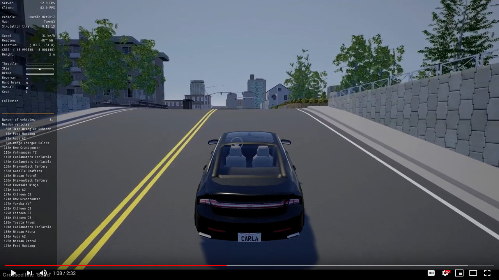

ScenarioRunner for CARLA
========================
This repository contains traffic scenario definition and an execution engine
for CARLA. It also allows the execution of a simulation of the CARLA Challenge.
You can use this system to prepare your agent for the CARLA Challenge.

Scenarios can be defined through a Python interface, and with the newest version
the scenario_runner also the upcoming [OpenSCENARIO](http://www.openscenario.org/) standard is supported.

Getting the ScenarioRunner
---------------------------

Use `git clone` or download the project from this page. Note that the master
branch contains the latest fixes and features, and may be required to use the latest features from CARLA.

It is important to also consider the release version that has to match the CARLA version.

* [Version 0.9.13](https://github.com/carla-simulator/scenario_runner/releases/tag/v0.9.13) and the 0.9.13 Branch: Compatible with [CARLA 0.9.13](https://github.com/carla-simulator/carla/releases/tag/0.9.13)
* [Version 0.9.12](https://github.com/carla-simulator/scenario_runner/releases/tag/v0.9.12) and the 0.9.12 Branch: Compatible with [CARLA 0.9.12](https://github.com/carla-simulator/carla/releases/tag/0.9.12)
* [Version 0.9.11](https://github.com/carla-simulator/scenario_runner/releases/tag/v0.9.11) and the 0.9.11 Branch: Compatible with [CARLA 0.9.11](https://github.com/carla-simulator/carla/releases/tag/0.9.11)
* [Version 0.9.10](https://github.com/carla-simulator/scenario_runner/releases/tag/v0.9.10) and the 0.9.10 Branch: Compatible with [CARLA 0.9.10](https://github.com/carla-simulator/carla/releases/tag/0.9.10)
* [Version 0.9.9](https://github.com/carla-simulator/scenario_runner/releases/tag/v0.9.9) and the 0.9.9 Branch: Compatible with [CARLA 0.9.9](https://github.com/carla-simulator/carla/releases/tag/0.9.9). Use the 0.9.9 branch, if you use CARLA 0.9.9.4.
* [Version 0.9.8](https://github.com/carla-simulator/scenario_runner/releases/tag/v0.9.8) and the 0.9.8 Branch: Compatible with [CARLA 0.9.8](https://github.com/carla-simulator/carla/releases/tag/0.9.8)
* [Version 0.9.7](https://github.com/carla-simulator/scenario_runner/releases/tag/v0.9.7) and the 0.9.7 Branch: Compatible with [CARLA 0.9.7](https://github.com/carla-simulator/carla/releases/tag/0.9.7) but not with the later release patch versions.
* [Version 0.9.6](https://github.com/carla-simulator/scenario_runner/releases/tag/v0.9.6) and the 0.9.6 Branch: Compatible with [CARLA 0.9.6](https://github.com/carla-simulator/carla/releases/tag/0.9.6)
* [Version 0.9.5](https://github.com/carla-simulator/scenario_runner/releases/tag/v0.9.5) and [Version 0.9.5.1](https://github.com/carla-simulator/scenario_runner/releases/tag/v0.9.5.1): Compatible with [CARLA 0.9.5](https://github.com/carla-simulator/carla/releases/tag/0.9.5)
* [Version 0.9.2](https://github.com/carla-simulator/scenario_runner/releases/tag/0.9.2): Compatible with [CARLA 0.9.2](https://github.com/carla-simulator/carla/releases/tag/0.9.2)

To use a particular version you can either download the corresponding tarball or simply checkout the version tag associated to the release (e.g. git checkout v0.9.5)

Currently no build is required, as all code is in Python.

Using the ScenarioRunner
------------------------

Please take a look at our [Getting started](Docs/getting_scenariorunner.md)
documentation.

Challenge Evaluation
---------------------

The CARLA Challenge has moved to the [CARLA Autonomous Driving Leaderboard](https://leaderboard.carla.org/). Please see the [leaderboard repository](https://github.com/carla-simulator/leaderboard) and the [getting started guide](https://leaderboard.carla.org/get_started/) for more information.

Contributing
------------

Please take a look at our [Contribution guidelines](https://carla.readthedocs.io/en/latest/#contributing).

FAQ
------

If you run into problems, check our
[FAQ](http://carla.readthedocs.io/en/latest/faq/).

License
-------

ScenarioRunner specific code is distributed under MIT License.
